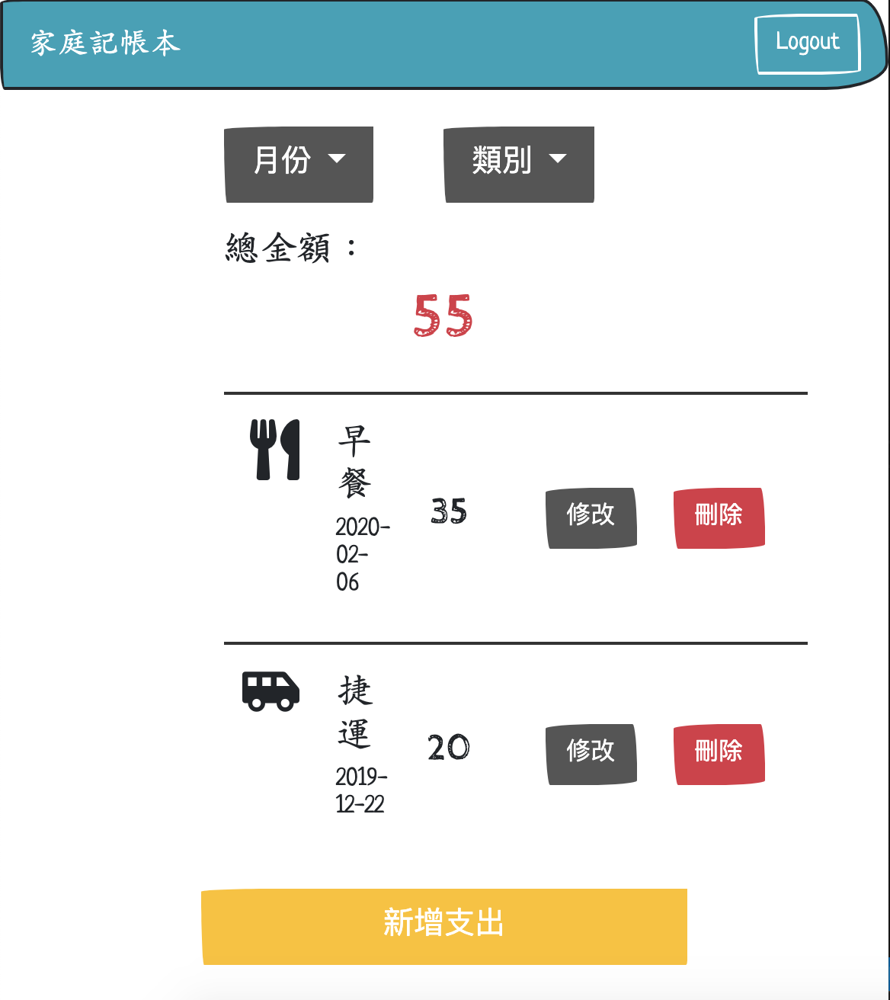
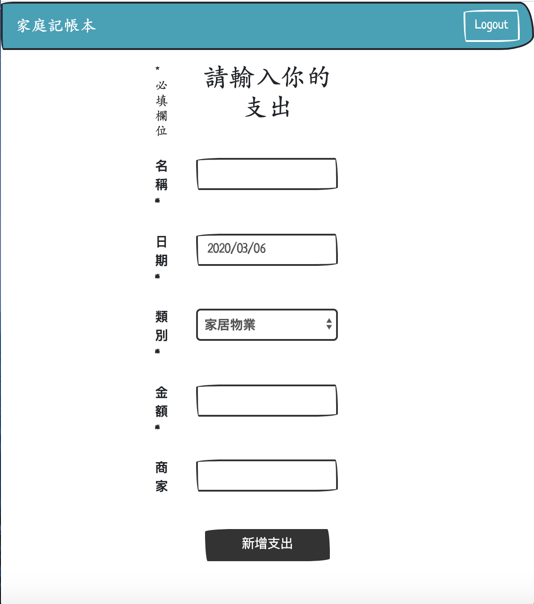
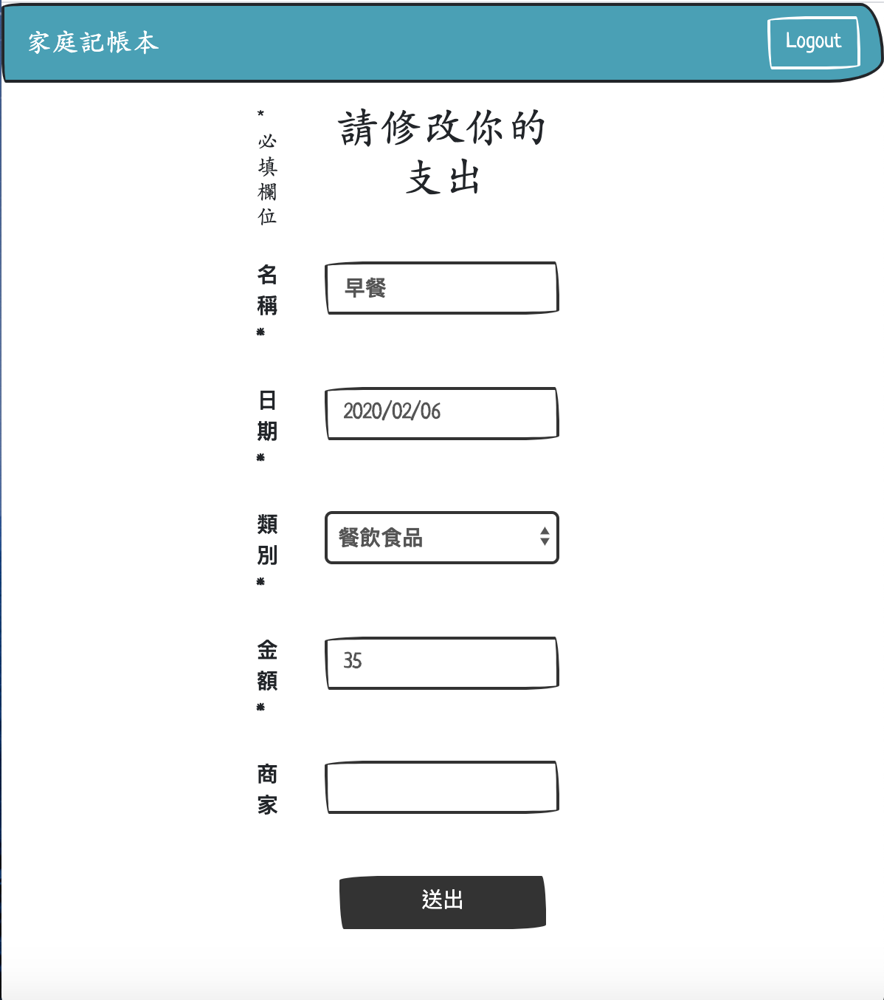
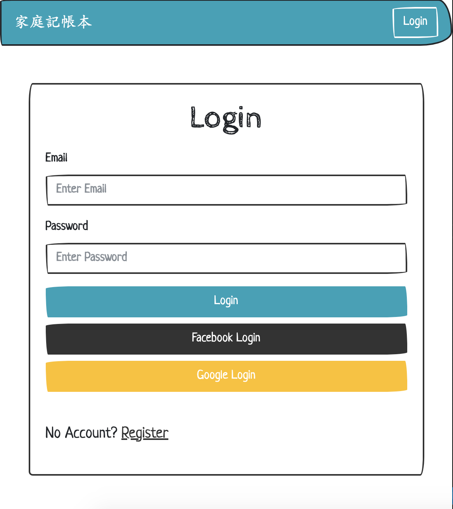
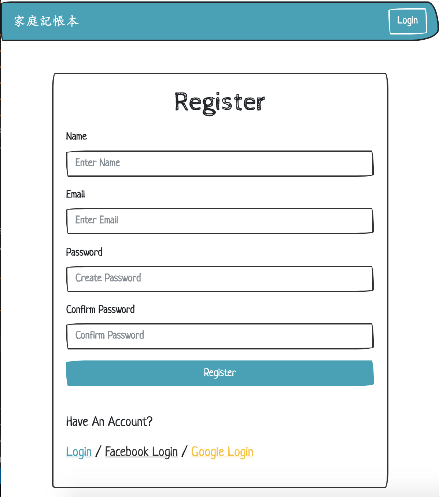

# Expense Tracker（家庭記帳本）

A simple web app built with Node.js, Express, and MySQL. Users can manage their own expense records and filter records by months or categories.

## Prerequisites

* [npm](https://www.npmjs.com/get-npm)
* [Node.js](https://nodejs.org/en/download/)
* [MySQL](https://dev.mysql.com/downloads/mysql/)
* [MySQL Workbench](https://dev.mysql.com/downloads/workbench/)

## Installing and execution

### Clone

**Clone this repository to your local machine**

```
git clone https://github.com/bluesmy/expense-tracker-sequelize.git
```

### Setup Database

**Create and use expense_sequelize database via MySQL Workbench**

> Run the following code

```
drop database if exists expense_sequelize;
create database expense_sequelize;
use expense_sequelize;
```

### Setup App

**1. Create a Facebook and a Google account**
- [https://developers.facebook.com/](https://developers.facebook.com/)
- [https://console.developers.google.com/apis](https://console.developers.google.com/apis)

**2. Create an app on Facebook and a project on Google and get the client ID & secret**

> Facebook

```
My Apps -> Create App -> Scenario: Integrate Facebook Login -> Settings -> Basic
```

> Google

```
Select a Project -> New Project -> Credentials -> Create Credentials -> OAuth Client ID
```

**3. Open terminal, change directory to the project folder**

```
$ cd expense-tracker-sequelize
```

**4. Install npm packages**

```
$ npm install
```

**5. Create .env file**

```
$ touch .env
```

**6. Store API Key in .env file and save**

> /.env
```
FACEBOOK_ID=<YOUR_FACEBOOK_APP_ID>
FACEBOOK_SECRET=<YOUR_FACEBOOK_APP_SECRET>
FACEBOOK_CALLBACK=<YOUR_FACEBOOK_REDIRECT_URI>
GOOGLE_ID=<YOUR_GOOGLE_PROJECT_ID>
GOOGLE_SECRET=<YOUR_GOOGLE_PROJECT_SECRET>
GOOGLE_CALLBACK=<YOUR_GOOGLE_REDIRECT_URI>
```

**7. Edit password in config.json file and delete  "operatorsAliases": false**

> /config/config.json
```
"development": {
  "username": "root",
  "password": "<YOUR_WORKBENCH_PASSWORD>",
  "database": "expense_sequelize",
  "host": "127.0.0.1",
  "dialect": "mysql"
}
```

**8. Create models in database**

> Run the following code in console
```
$ npx sequelize db:migrate
```

**9. Activate the server**

```
$ npm run dev
```

**10. Activation success if you find the message**

```
> App is running on port 3000!
```

You may visit the application on browser with the URL: [http://localhost:3000](http://localhost:3000)

## Features

- User can register an account
- User can login with registerd account or Facebook / Google account
- User can view all expense records and total expense amount
- User can add, edit, or delete expense records
- User can view expense records filterd by months or categories

## Screenshot







## Built with

* [Bcryptjs ^2.4.3](https://www.npmjs.com/package/bcryptjs) - Password hashing function used
* [Body-Parser ^1.19.0](https://www.npmjs.com/package/body-parser) - Parse incoming request bodies in a middleware before handlers
* [Connect-Flash ^0.1.1](https://www.npmjs.com/package/connect-flash) - Display flash message to user
* [Dotenv ^8.2.0](https://www.npmjs.com/package/dotenv) - Load environment variables from .env file into process.env
* [Express ^4.17.1](https://expressjs.com) - The web framework used
* [Express-Handlebars ^3.1.0](https://www.npmjs.com/package/express-handlebars) - The template engine used
* [Express-Session ^1.17.0](https://www.npmjs.com/package/express-session) - Enable session in express
* [Method-Override ^3.0.0](https://www.npmjs.com/package/method-override) - Enable usage of HTTP verbs such as PUT or DELETE
* [MySQL2 ^2.1.0](https://www.npmjs.com/package/mysql2) - A relational database management system
* [Node.js](https://nodejs.org/)- A JavaScript runtime built on Chrome's V8 JavaScript engine
* [Passport ^0.4.1](https://www.npmjs.com/package/passport)- Authentication middleware for Node.js
* [Passport-Facebook ^3.0.0](http://www.passportjs.org/packages/passport-facebook/) - Passport strategy for authenticating with Facebook using the OAuth 2.0 API
* [Passport-Google-OAuth20 ^2.0.0](http://www.passportjs.org/packages/passport-google-oauth20/) - Passport strategy for authenticating with Google using the OAuth 2.0 API
* [Passport-Local ^1.0.0](http://www.passportjs.org/packages/passport-local/) - Passport strategy for authenticating with a username and password
* [Sequelize ^5.21.5](https://sequelize.org/) - A promise-based Node.js ORM for MySQL
* [Sequelize-CLI ^5.5.1](https://github.com/sequelize/cli) - The Sequelize Command Line Interface (CLI)
* [Visual Studio Code](https://code.visualstudio.com/) - The integrated development environment used


## Contributor

* **Sheri Su** - [bluesmy](https://github.com/bluesmy)
